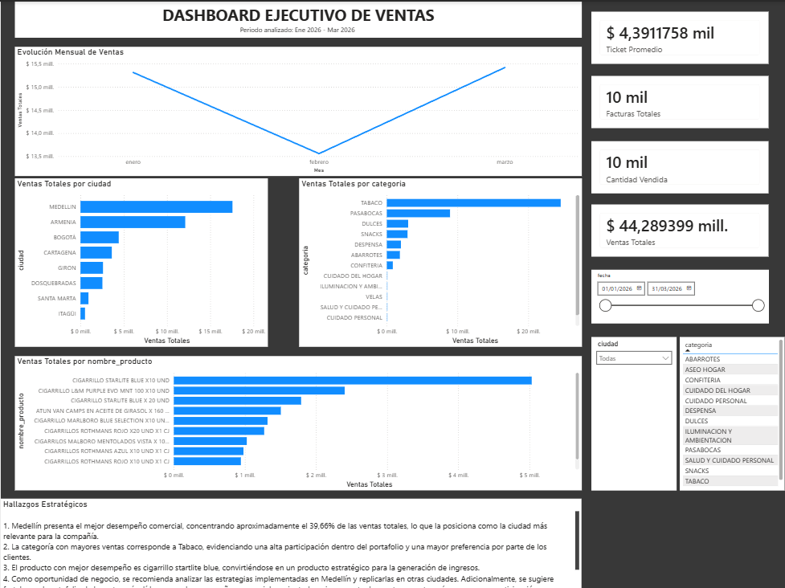

# Retail Sales Analytics Dashboard

## Project Overview

This project consists of an end-to-end sales analysis developed as part of a technical assessment for a Business Intelligence Analyst position.

The objective was to analyze sales performance across multiple cities, categories, and products, using data from a retail company.

The project includes:

* Data cleaning and consolidation using Excel and Power Query.
* Exploratory analysis using Pivot Tables.
* SQL queries for business analysis.
* Executive dashboard development in Power BI.
* Business insights and recommendations.

---

## Tools Used

* Microsoft Excel
* Power Query
* PostgreSQL
* SQL
* Power BI

---

## Dataset Description

Three CSV files were provided:

| File          | Description                     |
| ------------- | ------------------------------- |
| ventas.csv    | Transactional sales information |
| productos.csv | Product catalog                 |
| tiendas.csv   | Store information               |

---

## Key Business Questions

* Which city generated the highest sales?
* Which category presented the best performance?
* What are the top-selling products?
* What business opportunities can be identified?

---

## SQL Analysis

Examples of performed analysis:

* Total sales by city.
* Top 10 products by revenue.
* Monthly sales evolution.
* Sales participation percentage by category.

---

## Dashboard Features

### KPIs

* Total Sales
* Quantity Sold
* Total Invoices
* Average Ticket

### Visualizations

* Sales evolution over time.
* Sales by city.
* Sales by category.
* Top 10 products.

### Filters

* Date
* City
* Category

---

## Key Findings

* Medellín represented approximately 39.66% of total sales.
* Tobacco was the category with the highest sales.
* Starlite Blue Cigarettes showed the best performance.
* Replicating successful commercial strategies from Medellín in other cities could improve overall sales performance.

---

## Business Recommendation

It is recommended to strengthen low-performing categories to diversify revenue streams and reduce dependency on a single category.

---

## Dashboard Preview

---

## Author

Juan José Valencia
Junior Data Analyst | Software Developer
